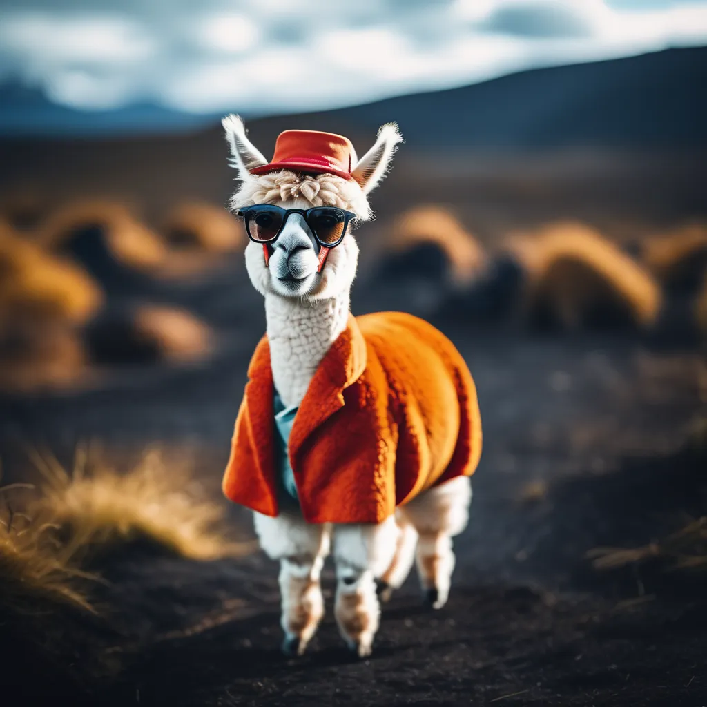
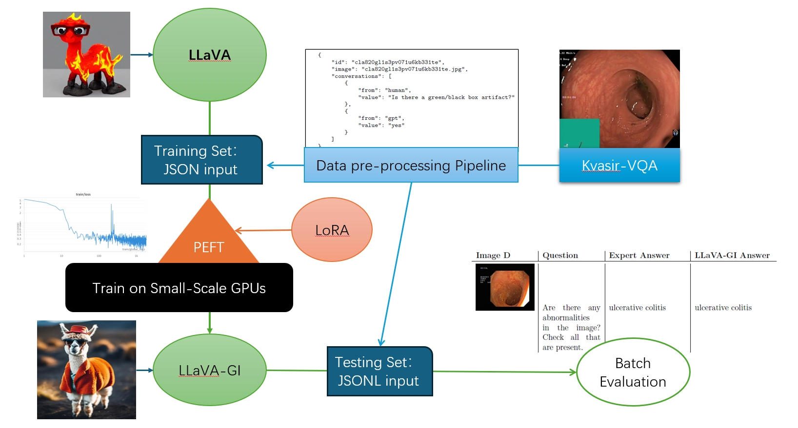
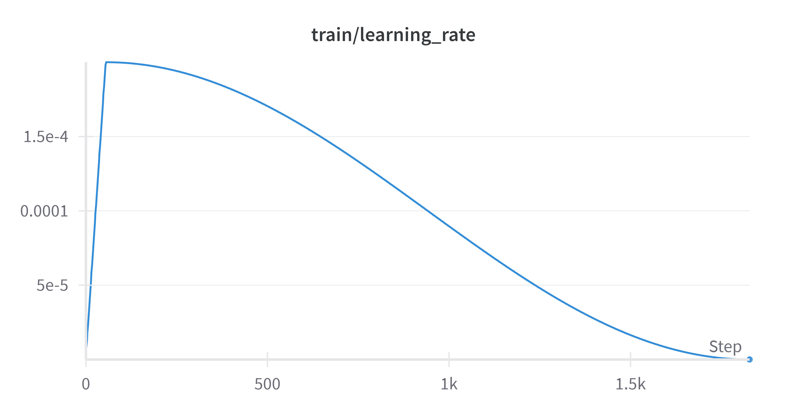

# LLaVA-GI, a custom LLaVA model trained on Kvasir-VQA






Hi, my name is Lareina. As a junior student, this is my first time training a VLM. Following are the steps and codes I used to do it, just for your reference. This project depends a lot on this tutorial https://www.youtube.com/watch?v=XICHJx2_Rm8&ab_channel=Brev. Thank you, Brev!

If you have problems, I may able not fix them because I am still learning this knowledge, however, I will try my best to help you solve them. And also, you can refer to https://github.com/haotian-liu/LLaVA for help

The dataset is here: https://huggingface.co/datasets/SimulaMet-HOST/Kvasir-VQA

---

## 1. Environment Setup

### Set Hugging Face Source (if needed)
```bash
export HF_ENDPOINT=https://hf-mirror.com
```

### Clone Project Repository
```bash
git clone https://github.com/haotian-liu/LLaVA.git
cd LLaVA && pip install --upgrade pip && pip install -e .
```

### Setup Conda Environment
```bash
conda create -n llava python=3.10 -y
conda activate llava
source ~/anaconda3/bin/activate
conda config --set auto_activate_base True
pip install --upgrade pip
pip install -e .
pip install -e ".[train]"
pip install flash-attn --no-build-isolation
git pull
pip install -e .
pip uninstall flash-attn
pip install flash-attn --no-build-isolation
```

### Additional Installations
```bash
pip install datasets
pip install --upgrade --force-reinstall Pillow
pip install wandb
wandb.login  # then enter your token, if you don't have one, go to wandb.ai and sign up
```
### if error happens, run this (usually, it's helpful)

```python
pip uninstall flash-attn;
pip install flash-attn --no-build-isolation
# if it suggests your torch is not compatible with your cuda version, you can install it manually like this
# conda install pytorch torchvision torchaudio pytorch-cuda=xxxxx -c pytorch -c nvidia # change to your vision

```

---

## 2. Data Preprocessing

### Script for Preprocessing
This script loads the dataset from Hugging Face, processes it, and saves images and structured JSON data.

```python
from datasets import load_dataset
from PIL import Image
from io import BytesIO
import requests
import os
import json
import uuid


def process_and_save(dataset, output_folder, subset_name):
subset_folder = os.path.join(output_folder, subset_name)
image_subfolder = os.path.join(output_folder, 'images')

if not os.path.exists(image_subfolder):
os.makedirs(image_subfolder)

if not os.path.exists(subset_folder):
os.makedirs(subset_folder)

json_data_list = []

for item in dataset:
# Load image if it's a URL or a file path
if isinstance(item['image'], str):
response = requests.get(item['image'])
image = Image.open(BytesIO(response.content))
else:
image = item['image']  # Assuming it's a PIL.Image object

# Use provided img_id as unique ID
unique_id = item['img_id']

# Define image path
image_path = os.path.join(image_subfolder, f"{unique_id}.jpg")

# Save image
image.save(image_path)

# Structure for JSON
json_data = {
"id": unique_id,
"image": f"{unique_id}.jpg",
"conversations": [
{
"from": "human",
"value": item['question']
},
{
"from": "gpt",
"value": item['answer']
}
]
}

# Append to list
json_data_list.append(json_data)

# Save the JSON data list to a file
json_output_path = os.path.join(subset_folder, 'dataset.json')
with open(json_output_path, 'w') as json_file:
json.dump(json_data_list, json_file, indent=4)

def save_dataset(dataset_name, output_folder):
# Load the dataset from Hugging Face
dataset = load_dataset(dataset_name, split='raw')


# Process and save the datasets
process_and_save(dataset, output_folder, 'train')


```

```python
# Main program
output_folder = '~\LLaVA'

save_dataset('SimulaMet-HOST/Kvasir-VQA', output_folder)

```
It would be like this [dataset.json](data\train\dataset.json)

### Manual Step
After preprocessing, manually split 300 samples out of the dataset.json file under the train folder into the validation folder
(the files should be like:)
```
data
   images
       (all images here)
   train
       dataset.json
   validation
       dataset.json
```
It would be like this [dataset.json](data\validation\dataset.json)
---

## 3. Model Training

Install DeepSpeed and initiate training:

```bash
pip install deepspeed;
# pip install flash-attn --no-build-isolationpip install deepspeed
pip install datasets;
pip install --upgrade --force-reinstall Pillow
pip install uuid;

```

```bash
cd ~/LLaVA
deepspeed
--include localhost:0,5 ~/LLaVA/llava/train/train_mem.py
--lora_enable True --lora_r 128 --lora_alpha 256 --mm_projector_lr 2e-5
--deepspeed ~/LLaVA/scripts/zero3.json # deepspeed config file
--model_name_or_path liuhaotian/llava-v1.5-13b # model name or path
--version v1
--data_path ~/LLaVA/data/train/dataset.json # path to the dataset.json file
--image_folder ~/LLaVA/data/images # path to the image folder
--vision_tower openai/clip-vit-large-patch14-336
--mm_projector_type mlp2x_gelu
--mm_vision_select_layer -2
--mm_use_im_start_end False
--mm_use_im_patch_token False
--image_aspect_ratio pad
--group_by_modality_length True
--bf16 True
--output_dir ~/LLaVA/checkpoints/llava-v1.5-13b-task-lora_3 # output directory, must include the word "llava"
--num_train_epochs 1
--per_device_train_batch_size 16
--per_device_eval_batch_size 4
--gradient_accumulation_steps 1
--evaluation_strategy "no"
--save_strategy "steps"
--save_steps 50000
--save_total_limit 1
--learning_rate 2e-4
--weight_decay 0.
--warmup_ratio 0.03
--lr_scheduler_type "cosine"
--logging_steps 1
--tf32 True
--model_max_length 2048
--gradient_checkpointing True
--dataloader_num_workers 4
--lazy_preprocess True
--report_to wandb
```

Can look up on wandb



---

## 4. Merging LoRA Weights

Combine LoRA weights with the base model:
```bash
python ~/LLaVA/scripts/merge_lora_weights.py
--model-path checkpoints/llava-v1.5-13b-task-lora
--model-base liuhaotian/llava-v1.5-13b
--save-model-path llava-ftmodel
```

---

## 5. Deploy and Chat on CLI

To run the model with the CLI interface:

```bash
cd ~/LLaVA;
CUDA_VISIBLE_DEVICES=0 python -m llava.serve.cli # change the device id to the ones you want to use
--model-path ~/LLaVA/fted/llava-ftmodel_1 # your custom model path
--image-file "xxxx.jpg" # path to the image file you want to chat on
--load-8bit
```

---

## 6. Evaluation

### Before evaluate, transform the questions in dataset.json to jsonl format
```python
import json

# 读取JSON文件
with open('~\LLaVA\data\validation\dataset.json', 'r', encoding='utf-8') as json_file:
# with open(r'~\LLaVA\data\validation\dataset.json', 'r', encoding='utf-8') as json_file: if you are window system
data = json.load(json_file)

# 写入问题文件（JSONL格式）
with open('~\LLaVA\data\validation\question.jsonl', 'w', encoding='utf-8') as question_file:
for item in data:
for conversation in item['conversations']:
if conversation['from'] == 'human':
question = {
"question_id": item['id'],
"image": item['image'],
"text": conversation['value']
}
question_file.write(json.dumps(question) + '\n')import json
# Code to convert dataset.json to question.jsonl (refer to Jupyter Notebook)
```

It would be like this [question.json](data\validation\qustion.json)

### Run evaluation:
```bash
CUDA_VISIBLE_DEVICES=0 python ~/LLaVA/model_vqa.py # change CUDA_VISIBLE_DEVICES to your device index
--model-path ~/LLaVA/fted/llava-ftmodel_1
--image-folder ~/LLaVA/data/images
--question-file ~/LLaVA/data/validation/question.jsonl
--answers-file ~/LLaVA/data/validation/answer.jsonl # output file path
--conv-mode llava_v1
--num-chunks 1
--chunk-idx 0
--temperature 0.3
--top_p 0.9
--num_beams 5
```

---

## Notes

- Ensure all dependencies are installed as specified.
- For assistance with compatibility issues, refer to official documentation.

---
